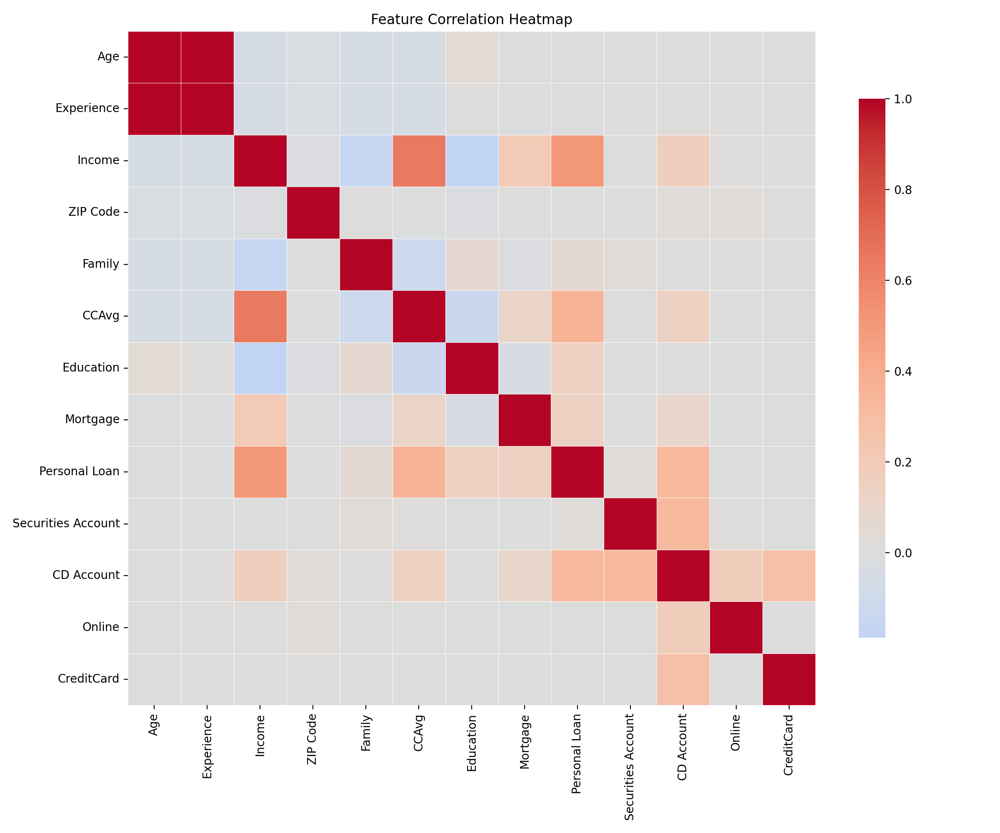
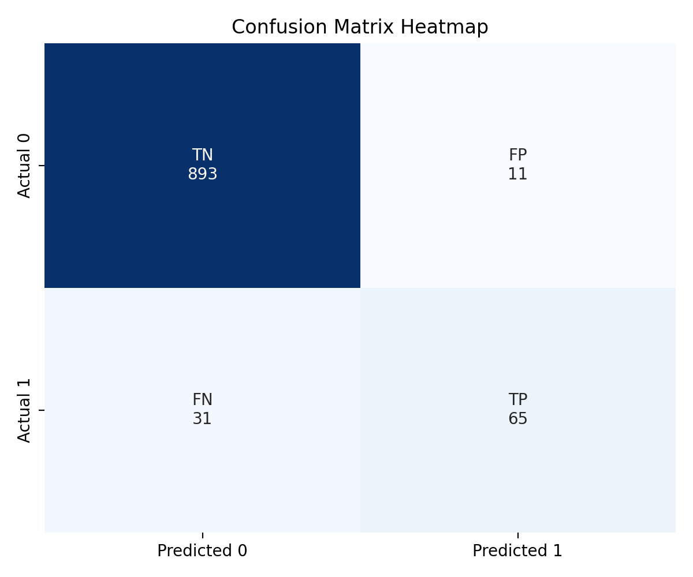
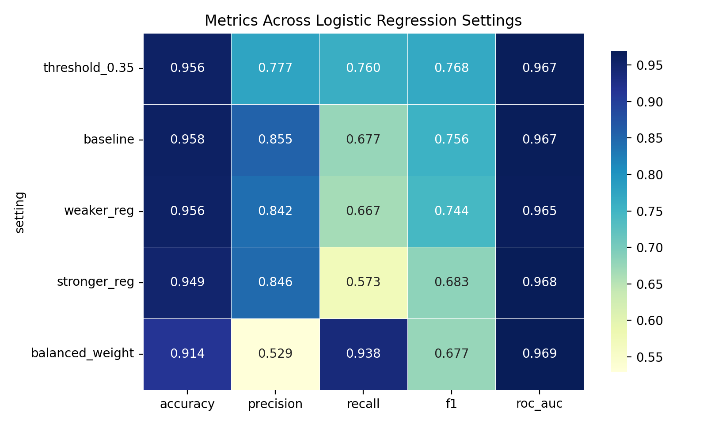
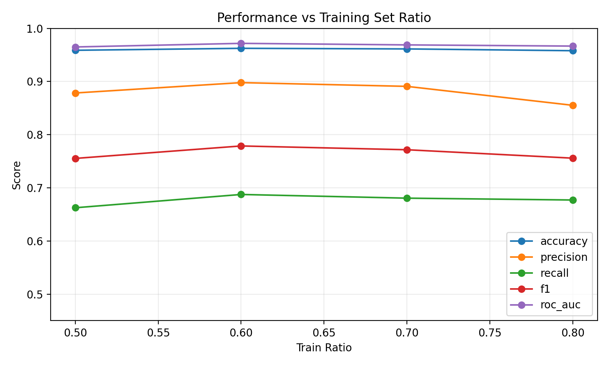

# Machine Learning Assignment Report (Draft)

## 1. Problem Statement
The objective is to predict whether a bank customer will accept a personal loan offer (`Personal Loan`: 1 = Yes, 0 = No). This is a supervised binary classification problem.

## 2. Dataset
- Dataset name: Bank Personal Loan Modelling
- File used: `dataset/Bank_Personal_Loan_Modelling.csv`
- Number of records: 5,000
- Number of columns: 14
- Target variable: `Personal Loan`

Key attributes include customer demographics (`Age`, `Experience`, `Family`, `Education`), financial indicators (`Income`, `CCAvg`, `Mortgage`), and account/service usage (`Securities Account`, `CD Account`, `Online`, `CreditCard`).

## 3. Data Preprocessing
Steps performed:
1. Loaded CSV data and checked for missing values.
2. Clipped negative values in `Experience` to 0 because negative years are not realistic.
3. Dropped `ID` and `ZIP Code` from model inputs (`ID` is purely an identifier; `ZIP Code` is high-cardinality location-like data in this baseline).
4. Standardized numeric features.
5. One-hot encoded categorical/discrete features.
6. Used stratified 80/20 train-test split due to class imbalance.

Class distribution:
- Class 0 (No Loan): 4,520
- Class 1 (Loan): 480

## 4. Algorithm and Justification
Logistic Regression was selected because:
- The target is binary.
- It is computationally efficient.
- It provides interpretable decision behavior and class probabilities.
- It is a strong baseline for tabular binary classification.

## 5. Implementation
Implementation is provided in:
- `src/logistic_regression_loan.py`
- `notebooks/logistic_regression_assignment.ipynb`

The implementation includes a preprocessing + model pipeline, evaluation metrics, confusion matrix, classification report, and 5-fold cross-validation ROC-AUC.
It also includes experiment tracking to show how model performance changes with:
- regularization strength (`C`)
- class weighting
- decision threshold
- training set size

## 6. Results
Using an 80/20 stratified split (`random_state = 42`), the baseline Logistic Regression produced:

- Accuracy: 0.9580
- Precision: 0.8553
- Recall: 0.6771
- F1-score: 0.7558
- ROC-AUC: 0.9667

Confusion matrix `[[TN, FP], [FN, TP]]`:
- `[[893, 11], [31, 65]]`

Cross-validation:
- 5-fold ROC-AUC mean: ~0.964
- 5-fold ROC-AUC std: low (stable performance)
- 5-fold F1-score mean: 0.7490
- 5-fold F1-score std: 0.0153

### 6.1 How Results Change with Training Settings

| Setting | C | Class Weight | Threshold | Accuracy | Precision | Recall | F1 | ROC-AUC |
|---|---:|---|---:|---:|---:|---:|---:|---:|
| threshold_0.35 | 1.0 | None | 0.35 | 0.9560 | 0.7766 | 0.7604 | 0.7684 | 0.9667 |
| baseline | 1.0 | None | 0.50 | 0.9580 | 0.8553 | 0.6771 | 0.7558 | 0.9667 |
| weaker_reg | 5.0 | None | 0.50 | 0.9560 | 0.8421 | 0.6667 | 0.7442 | 0.9653 |
| stronger_reg | 0.1 | None | 0.50 | 0.9490 | 0.8462 | 0.5729 | 0.6832 | 0.9684 |
| balanced_weight | 1.0 | balanced | 0.50 | 0.9140 | 0.5294 | 0.9375 | 0.6767 | 0.9693 |

Interpretation:
1. Lowering the threshold from 0.50 to 0.35 improved recall (0.6771 -> 0.7604) and improved F1 (0.7558 -> 0.7684), while precision dropped.
2. `class_weight='balanced'` gave very high recall but significantly lower precision and accuracy.
3. Stronger regularization (`C=0.1`) reduced recall and F1 in this dataset.

### 6.2 Effect of Training Set Size

| Train Ratio | Train Samples | Test Samples | Accuracy | Precision | Recall | F1 | ROC-AUC |
|---:|---:|---:|---:|---:|---:|---:|---:|
| 0.50 | 2500 | 2500 | 0.9588 | 0.8785 | 0.6625 | 0.7553 | 0.9651 |
| 0.60 | 3000 | 2000 | 0.9625 | 0.8980 | 0.6875 | 0.7788 | 0.9718 |
| 0.70 | 3499 | 1501 | 0.9614 | 0.8909 | 0.6806 | 0.7717 | 0.9689 |
| 0.80 | 4000 | 1000 | 0.9580 | 0.8553 | 0.6771 | 0.7558 | 0.9667 |

Interpretation:
1. Performance is generally stable across training sizes.
2. Best F1 in this run appeared at train ratio 0.60.
3. No severe overfitting pattern is visible from these splits.

### 6.3 Training Visualizations (Heatmaps and Plots)

Generated image files:
- `figures/correlation_heatmap.png`
- `figures/confusion_matrix_heatmap.png`
- `figures/settings_metrics_heatmap.png`
- `figures/training_size_performance.png`

Correlation heatmap:

Confusion matrix heatmap:

Metrics heatmap across training settings:

Performance vs training size:

## 7. Critical Analysis and Discussion
Strengths:
- High ROC-AUC indicates good ranking/discrimination ability.
- High precision means predicted positives are often correct.

Limitations:
- Recall is moderate; some true positive loan-accepting customers are missed.
- The dataset is imbalanced, so accuracy alone can be misleading.

Possible improvements:
1. Tune threshold to increase recall if the business prefers catching more potential borrowers.
2. Perform grid-search for `C`, penalty, and threshold jointly.
3. Compare with additional classifiers (Decision Tree, Random Forest, SVM, Gradient Boosting/XGBoost).
4. Add calibration checks for predicted probabilities.

## 8. Assignment Rule Check
The assignment description specifies: for supervised learning (team size 4), **4 distinct algorithms** should be applied.

This draft currently includes only **Logistic Regression**. If your team has 4 members and must comply fully, add 3 additional supervised algorithms and include a comparison table in the final report.

## 9. Individual Contribution (Template)
- Member A: Data preprocessing and EDA
- Member B: Logistic Regression implementation and metrics
- Member C: Comparative model implementation
- Member D: Report writing, critical analysis, and presentation

(Replace with actual member names and IDs.)
