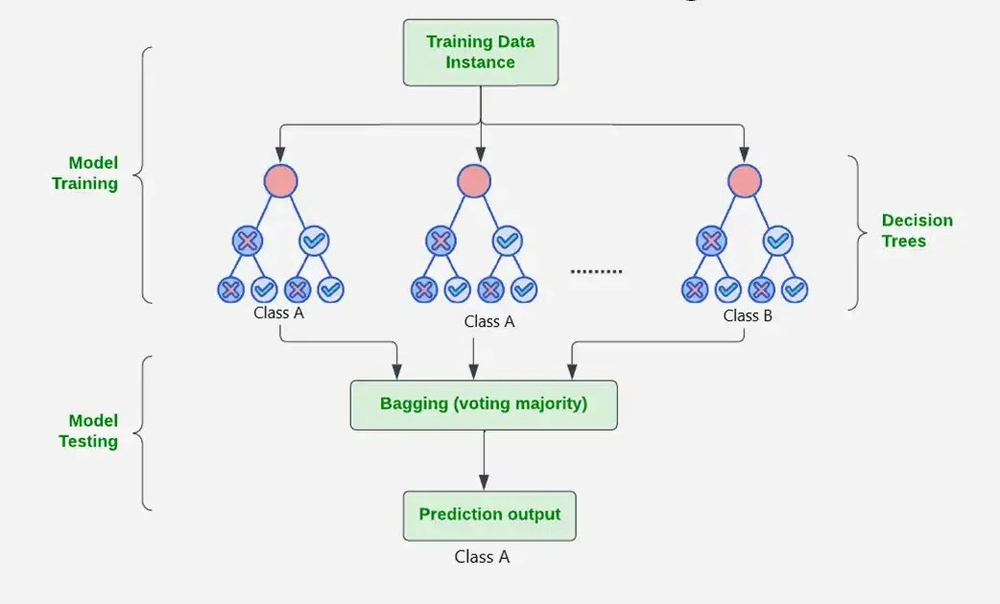

# Random Forest - Personal Loan Prediction

## What Is Random Forest?
Random Forest is an ensemble machine learning algorithm that combines many decision trees and takes a majority vote for classification.  
It improves generalization compared to a single tree by reducing overfitting and variance.

In this project, Random Forest predicts whether a customer will accept a personal loan (`Personal Loan = 1`) or not (`0`).

This implemented Random Forest model gives the final output by taking votes from many decision trees.  
Each tree predicts either `0` or `1` based on the input features, and the class with the most votes becomes the final prediction.  
The predicted probability shows how strongly the trees support that class.

## How Output Is Generated
1. Run `python run_random_forest.py`.
2. The pipeline loads data, preprocesses it, splits train/test, and performs `GridSearchCV`.
3. The best model is evaluated on both train and test sets.
4. Outputs are saved automatically to:
   - `outputs/reports/` (metrics, classification report, dataset summary)
   - `outputs/figures/` (plots)
   - `artifacts/` (trained model + metadata)
5. For inference, run `python predict.py` or provide a CSV using `--csv`.

## Diagram


## Dataset
- File: `dataset/Bank_Personal_Loan_Modelling.csv`
- Shape: `5000 rows x 14 columns`
- Target column: `Personal Loan`
- Class distribution:
  - Class `0`: `4520`
  - Class `1`: `480`

## Project Structure (key files)
- `run_random_forest.py`: Main training and evaluation pipeline.
- `predict.py`: Prediction script for single row or CSV input.
- `src/rf_loan/config.py`: Configuration (paths, split ratio, parameter grid).
- `src/rf_loan/data.py`: Dataset loading and feature/target split.
- `src/rf_loan/preprocessing.py`: Cleaning step (clips negative `Experience`).
- `src/rf_loan/modeling.py`: Model build, hyperparameter tuning, metrics, artifact export.
- `src/rf_loan/analysis.py`: Dataset-level visual analysis.
- `src/rf_loan/visualization.py`: Confusion matrix, ROC, PR, feature importance, learning/validation curves.
- `src/rf_loan/reporting.py`: Text summary report generation.

## Setup
From `Random_Forest/`:

```powershell
python -m venv .venv
.\.venv\Scripts\Activate.ps1
pip install -r requirements.txt
```

## Data & Preprocessing
- Load CSV data from `dataset/`.
- Remove non-predictive columns: `ID`, `ZIP Code`.
- Keep target: `Personal Loan`.
- Clip invalid negative values in `Experience` to `0`.
- Use stratified train/test split (`test_size=0.2`, `random_state=42`).

## Training
- Model: `RandomForestClassifier`
- Tuning: `GridSearchCV` with 5-fold cross-validation
- Scoring metric: `F1`
- Best parameters found:
  - `n_estimators = 200`
  - `max_depth = 7`
  - `min_samples_split = 15`
  - `min_samples_leaf = 6`
  - `max_features = sqrt`
  - `class_weight = None`

## Results
### Test set
- Accuracy: `0.9900`
- Precision: `0.9574`
- Recall: `0.9375`
- F1 Score: `0.9474`
- ROC-AUC: `0.9977`
- Average Precision: `0.9844`

### Train set
- Accuracy: `0.9883`
- Precision: `0.9856`
- Recall: `0.8906`
- F1 Score: `0.9357`
- ROC-AUC: `0.9987`
- Average Precision: `0.9899`

## Observations
- The model performs strongly on both train and test sets.
- Very high ROC-AUC and F1 indicate strong separation and balanced classification quality.
- Train and test performance are close, suggesting good generalization.
- Minority class (`Personal Loan = 1`) is much smaller, so precision/recall tracking is important.

## Visuals & Explainability
Generated files in `outputs/figures/` include:
- `class_distribution_rf.png`
- `top_feature_distributions_rf.png`
- `confusion_matrix_rf.png`
- `roc_curve_rf.png`
- `precision_recall_curve_rf.png`
- `target_correlation_rf.png`
- `feature_importance_rf.png`
- `permutation_importance_rf.png`
- `learning_curve_rf.png`
- `validation_curve_rf.png`

These help explain model behavior, identify influential features, and assess fit quality.

## Optimization
Current optimization is done through `GridSearchCV` on key Random Forest hyperparameters.  
Further optimization ideas:
- Expand search space (`n_estimators`, `max_depth`, `min_samples_*`).
- Use class balancing methods if minority recall needs improvement.
- Try threshold tuning for better precision/recall trade-off.
- Compare with additional models for benchmarking.

## Author
**Nimes R H R**  
**IT22577160**  
**Contribution:** Designed and implemented the Random Forest pipeline, including preprocessing, model tuning, evaluation, visualization, artifact export, and prediction interface.
