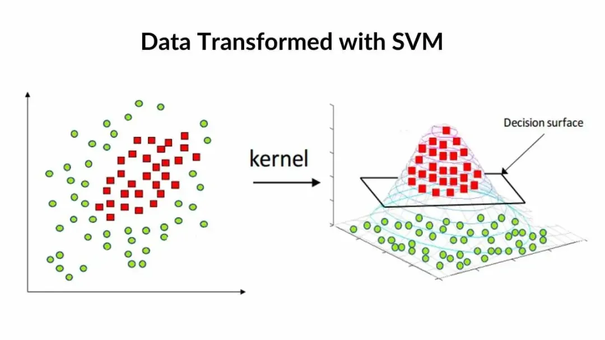

# SVM Personal Loan Project

This project predicts whether a customer will accept a personal loan using:
- Base SVM
- SMOTE + SVM

## What Is SVM And How It Is Used Here
Support Vector Machine, or SVM, is a supervised learning algorithm mainly used for classification. It works by finding the optimal decision boundary, called a hyperplane, that separates two classes with the maximum possible margin. The data points closest to this boundary are called support vectors, and they are the most important points in defining the classifier.

In this project, SVM is used as a binary classification model to predict the `Personal Loan` target, where `0` means the customer did not accept the loan offer and `1` means the customer accepted it. Because the dataset contains both numerical and discrete features, the pipeline first preprocesses the data, scales the numerical attributes, and then applies the SVM classifier. Two SVM-based approaches are included: a base SVM with class balancing, and a `SMOTE + SVM` version to improve minority-class detection.

## Folder Structure
- `dataset/` : source dataset
- `src/svm_loan/` : core reusable code
- `scripts/` : runnable training and prediction scripts
- `outputs/base_svm/` : reports and figures for the normal SVM
- `outputs/smote_svm/` : reports and figures for the SMOTE + SVM model
- `outputs/analysis_helpers/` : presentation helper visuals
- `artifacts/base_svm/` : saved base SVM model and metadata
- `artifacts/smote_svm/` : saved SMOTE + SVM model and metadata
- `notebooks/` : Jupyter notebook version
- `samples/` : sample CSV input for prediction

## Run Commands
Train base SVM:
`python scripts/run_training.py`

Train SMOTE + SVM:
`python scripts/run_smote_svm_experiment.py`

Predict with base SVM:
`python scripts/predict_svm.py`

Predict with SMOTE + SVM:
`python scripts/predict_smote_svm.py`

## Models
### Base SVM
Saved model:
- `artifacts/base_svm/model/svm_model.joblib`

Main reports:
- `outputs/base_svm/reports/metrics.json`
- `outputs/base_svm/reports/classification_report.txt`

Main figures:
- `outputs/base_svm/figures/confusion_matrix.png`
- `outputs/base_svm/figures/roc_curve.png`
- `outputs/base_svm/figures/learning_curve_svm.png`
- `outputs/base_svm/figures/validation_curve_svm.png`
- `outputs/base_svm/figures/train_test_metrics_svm.png`

### SMOTE + SVM
Saved model:
- `artifacts/smote_svm/model/smote_svm_model.joblib`

Main reports:
- `outputs/smote_svm/reports/metrics_smote_svm.json`
- `outputs/smote_svm/reports/classification_report_smote_svm.txt`

Main figures:
- `outputs/smote_svm/figures/confusion_matrix_smote_svm.png`
- `outputs/smote_svm/figures/train_test_metrics_smote_svm.png`

## Data Transformation Preview
This image can be used in the demo to show the transformed data view used before SVM training.

## Current Best Results
### Base SVM
- Accuracy: 0.983
- Precision: 0.9247
- Recall: 0.8958
- F1-score: 0.9101
- ROC-AUC: 0.9942

### SMOTE + SVM
- Accuracy: 0.983
- Precision: 0.8911
- Recall: 0.9375
- F1-score: 0.9137
- ROC-AUC: 0.9943

## Recommended Demo Flow
1. Show the folder structure.
2. Show `scripts/run_training.py` or `scripts/run_smote_svm_experiment.py`.
3. Show preprocessing and model logic in `src/svm_loan/`.
4. Show the final metrics report.
5. Show confusion matrix and train/validation curves.
6. Mention the saved model artifact.
