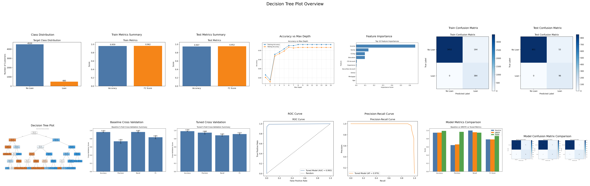

# LoanLens: Decision Tree Report

## 1. Problem Addressed

This part of the project focuses on **personal loan prediction** using a **supervised machine learning** approach. The objective is to predict whether a customer will accept a personal loan offer based on customer profile and banking-related attributes.

This is a **classification problem** because the target variable, `Personal Loan`, has two classes:

- `0` = customer did not accept the loan
- `1` = customer accepted the loan

The selected algorithm for this section is a **Decision Tree Classifier**.

## 2. Why This Dataset Was Chosen

This dataset was chosen because it is suitable for supervised classification and contains a clear target column with multiple customer-related predictive attributes.

Reasons for choosing this dataset:

- it contains labeled output values in `Personal Loan`
- it includes several meaningful banking features such as `Income`, `Family`, `CCAvg`, `Education`, and `Mortgage`
- it is complex enough for a machine learning task and not just a toy example
- it is hosted publicly online

Dataset source:

- Kaggle: https://www.kaggle.com/datasets/krantiswalke/bank-personal-loan-modelling

Local dataset used in this folder:

- `Bank_Personal_Loan_Modelling.csv`

## 3. Dataset Description

The dataset contains **5000 rows** and **14 columns**.

Attributes:

- `ID`: unique customer identifier
- `Age`: age of the customer
- `Experience`: years of work experience
- `Income`: annual income
- `ZIP Code`: residential ZIP code
- `Family`: family size
- `CCAvg`: average monthly credit card spending
- `Education`: education level
- `Mortgage`: mortgage amount
- `Personal Loan`: target variable
- `Securities Account`: whether the customer has a securities account
- `CD Account`: whether the customer has a certificate of deposit account
- `Online`: whether the customer uses online banking
- `CreditCard`: whether the customer uses the bank's credit card

Dataset observations from the file used here:

- total rows: `5000`
- total columns: `14`
- missing values: `0`
- duplicate rows: `0`
- class distribution:
  - `4520` customers in class `0`
  - `480` customers in class `1`

This shows that the dataset is **imbalanced**, because the number of non-loan customers is much larger than the number of loan customers.

## 4. Data Preprocessing

Preprocessing was mainly **manual and dataset-driven**, because the dataset was already clean and numeric.

Steps performed:

1. Loaded the CSV dataset.
2. Checked for missing values.
3. Checked for duplicate rows.
4. Removed `ID` because it is only an identifier and does not help prediction.
5. Removed `ZIP Code` because it behaves like a location code and is not a strong generalizable predictive feature for this model.
6. Selected `Personal Loan` as the target variable.
7. Split the data into training and testing sets using an **80:20 split**.
8. Used `stratify=y` to preserve the class distribution in both train and test sets.

Why no scaling or encoding was used:

- Decision Tree does not require normalization or standardization.
- The dataset was already numeric, so no encoding was needed.
- No missing-value imputation was required because there were no missing values.

## 5. Why Decision Tree Was Chosen

Decision Tree was selected because:

- it is easy to understand and interpret
- it works well for classification tasks
- it can handle numerical input features directly
- it does not require feature scaling
- it allows the model structure to be visualized
- it provides feature importance values, which help explain predictions

This makes Decision Tree a strong choice for an academic assignment because both the prediction logic and the evaluation can be explained clearly.

## 6. Model Parameters and Why They Were Chosen

### Initial baseline model

The initial model used:

- `criterion='gini'`
- `max_depth=5`
- `min_samples_split=10`
- `min_samples_leaf=5`
- `class_weight='balanced'`
- `random_state=42`

Why these values were chosen:

- `gini` is a standard impurity measure for classification.
- `max_depth=5` was chosen to keep the tree interpretable and reduce overfitting.
- `min_samples_split=10` prevents very small unstable splits.
- `min_samples_leaf=5` prevents tiny leaf nodes.
- `class_weight='balanced'` was used because the dataset is imbalanced.
- `random_state=42` ensures reproducible results.

### Tuned model

Hyperparameter tuning using `GridSearchCV` produced a better Decision Tree:

- `criterion='entropy'`
- `max_depth=4`
- `min_samples_split=5`
- `min_samples_leaf=1`
- `class_weight=None`

Why the tuned model performed better:

- `entropy` created better splits for this dataset
- `max_depth=4` kept the tree simpler and generalized better
- `min_samples_split=5` allowed useful splitting without unnecessary restriction
- the tuned search found that extra class weighting was not needed after optimization

## 7. Train/Test Split

The dataset was split as:

- training data: `4000` rows
- testing data: `1000` rows

The training set was used to fit the model.
The testing set was kept separate and used for final evaluation.

## 8. Results

### Baseline Decision Tree results

- train accuracy: `0.9590`
- test accuracy: `0.9470`

Test confusion matrix:

```text
[[851  53]
 [  0  96]]
```

Baseline classification report for class `1`:

- precision: `0.6443`
- recall: `1.0000`
- F1-score: `0.7837`

### SMOTE model results

- test accuracy: `0.9490`

Class `1` metrics:

- precision: `0.6619`
- recall: `0.9583`
- F1-score: `0.7830`

### Tuned Decision Tree results

- test accuracy: `0.9920`

Class `1` metrics:

- precision: `0.9681`
- recall: `0.9479`
- F1-score: `0.9579`

### Final model choice

The **tuned Decision Tree** is the best model in this folder because it gives the strongest overall performance and the best balance between precision, recall, and F1-score.

## 9. Feature Importance

The most important features in the baseline model were:

- `Income`
- `Family`
- `CCAvg`
- `Education`

This suggests that customer income, family context, spending behavior, and education level are the strongest indicators of personal loan acceptance.

The root node chosen by the original trained tree was:

- `Income <= 92.5`

This means the model first splits customers by income because that gave the best impurity reduction at the top of the tree.

## 10. Diagrams

The script now saves the generated charts as a **single combined overview image** instead of separate image files. The combined image includes:

- class distribution
- train metrics summary
- test metrics summary
- train confusion matrix
- test confusion matrix
- feature importance
- accuracy vs max depth
- decision tree plot
- baseline vs SMOTE vs tuned metrics comparison
- baseline vs SMOTE vs tuned confusion matrix comparison
- baseline 5-fold cross-validation summary
- tuned 5-fold cross-validation summary
- ROC curve
- precision-recall curve

Combined overview image:



## 11. Critical Analysis and Discussion

The baseline model achieved high recall for class `1`, which means it correctly identified all actual loan-accepting customers in the test set. However, its precision was relatively low because it produced many false positives.

Applying SMOTE gave only a small change in performance. It slightly improved accuracy and precision but reduced recall compared with the baseline model.

The tuned Decision Tree gave the strongest result overall. It greatly improved precision and F1-score while maintaining very high recall. This means the tuned model was much better at identifying likely loan customers without producing too many incorrect positive predictions.

The large performance improvement after tuning shows that hyperparameter selection has a strong impact on Decision Tree performance.

To further check model stability, 5-fold cross-validation was added. This helps confirm that the model is not performing well on only a single random split. ROC-AUC and precision-recall curves were also added to evaluate ranking quality across multiple thresholds, which is especially useful for an imbalanced classification problem.

## 12. Limitations and Future Work

Even though the tuned model performed very well, several improvements could still be explored:

- compare with other algorithms such as Random Forest, Logistic Regression, or XGBoost
- test more advanced imbalance-handling methods
- perform deeper feature engineering
- evaluate calibration and threshold tuning for business-specific decision making

## 13. Files in This Folder

- `Bank_Personal_Loan_Modelling.csv`
- `decision_tree_loan.py`
- `decision_tree_loan.ipynb`
- `requirements.txt`
- `output/all_plots_overview/...`

## 14. How To Run

Install dependencies:

```bash
python3 -m pip install -r decision_tree/requirements.txt
```

Run the script:

```bash
python3 decision_tree/decision_tree_loan.py
```

This will:

- train the Decision Tree models
- print the evaluation results
- save one combined chart sheet into `output/all_plots_overview/`
